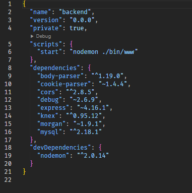

<h2 align="center">Proper Dark Theme</h2>

## Description

This theme is a proper dark theme designed to provide a comfortable viewing experience in low-light environments. It features high contrast, easy-to-read text, and a sleek design.

### Features

- High contrast for better readability
- Sleek and modern design
- Supports various programming languages and file types

### Compatibility

- Compatible with most code editors and IDEs

1. Download the theme from the repository.
2. Follow the installation instructions specific to your code editor or IDE.
3. Apply the theme and enjoy a better coding experience in the dark.

## Screenshots

#### Markdown

 

#### JS, React, Node

 

#### JSON

 

#### Python

 

#### CSS

 

#### HTML

 
